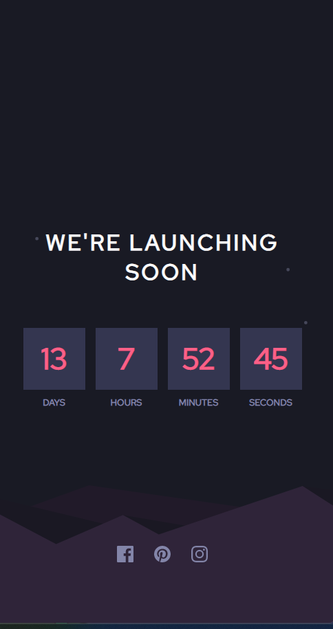
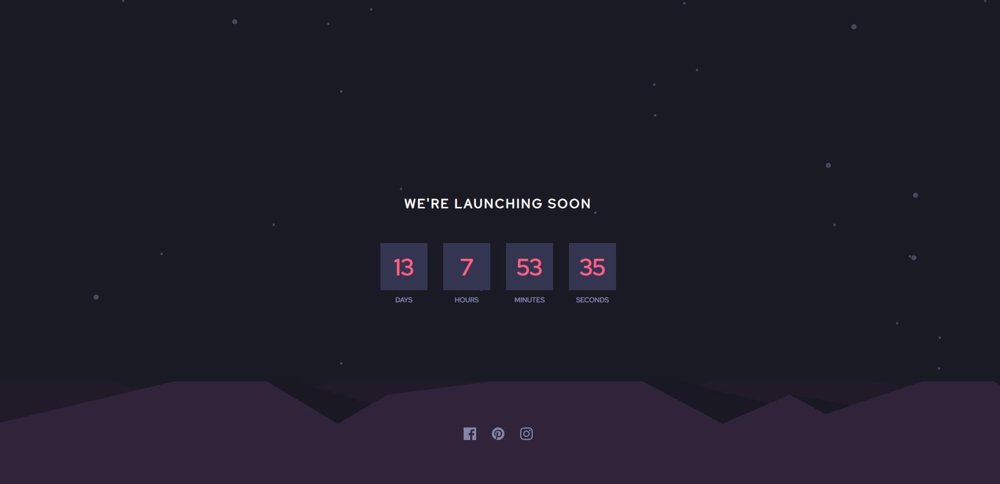

# Frontend Mentor - Launch countdown timer solution

This is a solution to the [Launch countdown timer challenge on Frontend Mentor](https://www.frontendmentor.io/challenges/launch-countdown-timer-N0XkGfyz-). Frontend Mentor challenges help you improve your coding skills by building realistic projects. 

### The challenge

Users should be able to:

- See hover states for all interactive elements on the page
- See a live countdown timer that ticks down every second (start the count at 14 days)
- **Bonus**: When a number changes, make the card flip from the middle

### Screenshot

Mobile View

Desktop View

### Links

- Solution URL: [Github](https://github.com/IanMcbull/frontend-mentor-launch-countdown-challenge)
- Live Site URL: [Countdown Launcher](https://launchcounterfrontendmentor.netlify.app/)

### Built with

- Semantic HTML5 markup
- CSS custom properties
- Flexbox

## Author

- Website - [Ian Mugenya](https://ianmugenya.netlify.app/)
- Frontend Mentor - [@IanMcbull](https://www.frontendmentor.io/profile/IanMcbull)
- Twitter - [@Mcbooll](https://twitter.com/McBooll)

